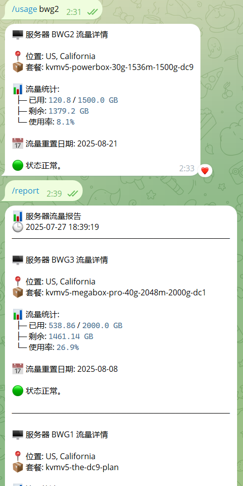

[中文版](README.zh_CN.md)|English

# BWG Bot - Server Usage Monitoring Bot

A Telegram bot that monitors server usage for BandwagonHost (BWG) VPS servers by querying the 64clouds API and sending automated reports to configured Telegram groups or users at specific scheduled times.

## Features

- 📊 **Real-time server monitoring**: Query individual server usage statistics
- 📈 **Automated reporting**: Send periodic usage reports to multiple groups/users
- 🔍 **Multi-server support**: Monitor multiple servers with different configurations
- 🎯 **Flexible notifications**: Configure different servers for different groups
- 📅 **Flexible scheduling**: Set specific times for daily, weekly, or monthly reports
- 🛡️ **Error handling**: Comprehensive error handling and logging

## Bot Commands

- `/usage <server_name>` - Query individual server usage statistics
- `/report` - Generate a report for all configured servers
- `/getgroupid` - Get the current chat/group ID for configuration

## Screencopy



## Installation

1. **Clone the repository**:
   ```bash
   git clone <repository-url>
   cd bwgbot
   ```

2. **Install dependencies**:
   ```bash
   pip install -r requirements.txt
   ```

3. **Configure environment variables**:
   Create a `.env` file in the project root:
   ```env
   # Telegram Bot Token (required)
   BOT_TOKEN=your_telegram_bot_token_here
   
   # Auto report schedule (optional, default: daily:09:00)
   # Supported formats:
   # - Daily: daily:HH:MM (e.g., daily:09:00)
   # - Weekly: weekly:DAY:HH:MM or DAY:HH:MM (e.g., MON:09:00)
   # - Monthly: monthly:DD:HH:MM or DD:HH:MM (e.g., 06:09:00)
   AUTO_REPORT_SCHEDULE=daily:09:00
   
   # Server configurations (add as many as needed)
   SERVER1_VEID=your_veid_here
   SERVER1_API_KEY=your_api_key_here
   
   SERVER2_VEID=another_veid_here
   SERVER2_API_KEY=another_api_key_here
   
   # Group configurations (optional, for auto-reporting)
   GROUP_CONFIG_1=-1001234567890:server1,server2
   GROUP_CONFIG_2=123456789:server1
   ```

4. **Run the bot**:
   ```bash
   python bot.py
   ```

## Configuration

### Server Configuration

You can access [here](https://bandwagonhost.com/whmcsExportServiceInfoCsv.php) to get all VEID and API Keys under your current BWG account。

For each server you want to monitor, add two environment variables:
- `{SERVER_NAME}_VEID`: The VEID from your BWG control panel
- `{SERVER_NAME}_API_KEY`: The API key from your BWG control panel

The `SERVER_NAME` can be any identifier you choose (e.g., `US1`, `EU1`, `ASIA1`).

### Group Configuration

To enable automated reporting, configure groups/users:
- Format: `GROUP_CONFIG_{N}={CHAT_ID}:{SERVER_LIST}`
- `{N}`: Sequential number (1, 2, 3, ...)
- `{CHAT_ID}`: Telegram group ID (negative) or user ID (positive)
- `{SERVER_LIST}`: Comma-separated list of server names

**Examples**:
```env
# Send reports about server1 and server2 to a group
GROUP_CONFIG_1=-1001234567890:server1,server2

# Send reports about server1 to a user
GROUP_CONFIG_2=123456789:server1
```

### Getting Chat IDs

1. Add the bot to your group or start a private chat
2. Send `/getgroupid` command
3. Copy the returned ID to your `.env` file

## API Integration

This bot uses the 64clouds API to fetch server statistics. You'll need:
1. Your VEID (Virtual Environment ID) from the BWG control panel
2. Your API key from the BWG control panel

## Scheduling Examples

### Daily Reports
```env
# Send reports every day at 9:00 AM
AUTO_REPORT_SCHEDULE=daily:09:00
```

### Weekly Reports
```env
# Send reports every Monday at 9:00 AM
AUTO_REPORT_SCHEDULE=MON:09:00
# or
AUTO_REPORT_SCHEDULE=weekly:MON:09:00
```

### Monthly Reports
```env
# Send reports on the 6th of each month at 9:00 AM
AUTO_REPORT_SCHEDULE=06:09:00
# or
AUTO_REPORT_SCHEDULE=monthly:06:09:00
```

**Supported weekdays**: MON, TUE, WED, THU, FRI, SAT, SUN

## Usage Examples

### Query Individual Server
```
/usage server1
```

### Generate Full Report
```
/report
```

### Get Chat ID
```
/getgroupid
```

## Error Handling

The bot includes comprehensive error handling:
- Network timeout protection
- API error detection and reporting
- Configuration validation on startup
- Graceful failure with user notifications

## Logging

The bot logs all activities including:
- Configuration loading
- API requests and responses
- Error conditions
- Report generation and delivery

## Requirements

- Python 3.7+
- Telegram Bot API token
- BWG account with API access

## License

This project is open source and available under the MIT License.

## Contributing

Contributions are welcome! Please feel free to submit a Pull Request.

## Support

If you encounter any issues or have questions, please open an issue in the repository.